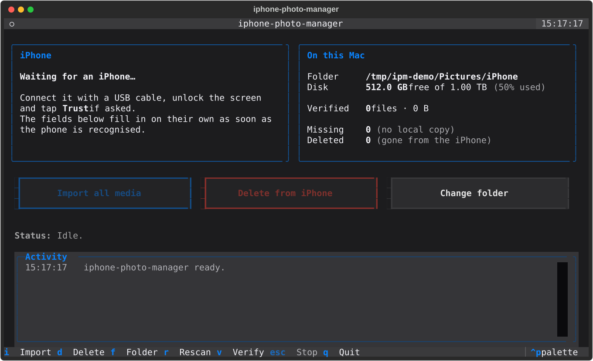

# iphone-photo-manager

[](https://github.com/EmanueleSeminara/iphone-photo-manager/actions/workflows/ci.yml)
[](#requirements)
[](LICENSE)
[](#requirements)

A persistent terminal app for macOS that imports **every** photo, video and Live Photo
from an iPhone over USB — untouched, byte for byte — and then, **only when you decide
to**, deletes from the phone the files it has verified on your Mac.

```
ipm
```

That is the whole interface. One command, one live screen, two buttons.

<!-- Generated from the running app with `App.export_screenshot()` at 110x32, the
     idle state with no phone connected and a placeholder destination. The volume
     figures are a fixed 512 GB of 1 TB so the image does not depend on the machine
     that made it. Replace with a GIF of a real import when you have one. -->


## Why it exists

Getting photos off an iPhone without iCloud is unpleasant. Photos.app wants to own your
library, Image Capture silently gives up halfway through large transfers, and "just drag
the files" is not a thing on iOS. Every alternative that *does* work tends to either
re-encode your HEIC files, drop the video half of Live Photos, or offer a delete-after-import
switch that deletes before you have checked anything.

`iphone-photo-manager` does three things and nothing else:

1. tells you what is plugged in, live;
2. copies everything to `YYYY/MM/` folders on your Mac, resumable and lossless;
3. deletes from the phone — as a separate, deliberate, typed-confirmation action — only
   the files whose local copy it has just re-verified.

## How it works

* **AFC over USB.** The app talks to the phone through Apple's own
  [AFC](https://en.wikipedia.org/wiki/Apple_File_Conduit) service using
  [`pymobiledevice3`](https://github.com/doronz88/pymobiledevice3). No iCloud, no iTunes,
  no Finder sync, no account, no network. Nothing leaves your machine.
* **No installation of system tools.** On macOS the `usbmuxd` daemon ships with the OS
  (Apple Mobile Device Support). Plug the cable in, unlock the phone, tap *Trust*.
* **Nothing is re-encoded.** HEIC stays HEIC, RAW stays RAW, `.MOV` and `.AAE` sidecars
  come along, modification times are preserved. The app never converts, resizes or
  compresses anything.
* **A persistent TUI, not a set of commands.** Built with
  [Textual](https://github.com/Textualize/textual). It stays open, watches the USB bus
  and fills the panel in the moment you plug the phone in — even if it was not connected
  when you started the app. It uses macOS's own system palette, so the red that guards
  deletion is the red macOS uses for the same purpose everywhere else; `ctrl+p` switches
  to any of Textual's twenty-one built-in themes if you prefer one of those.

## Requirements

* macOS (Apple Silicon or Intel). The code is portable and the business logic is
  platform-neutral, but only macOS is supported and tested for v1.
* Python 3.11 or newer.
* An iPhone or iPad, a USB **data** cable, and the phone trusted (unlock it and tap
  *Trust* the first time). After that, scanning, importing and deleting have all worked
  with the screen locked.

## Tested on

Automated tests cover every rule that does not need hardware, but what a real iPhone
does can only be found out by plugging one in. This is the honest state of that, model
by model.

| iPhone | iOS | macOS | Detection & scan | Import | Library check | Delete | Tested by |
|---|---|---|---|---|---|---|---|
| iPhone 13 | 26.6.1, 26.7.1 | 26 (Tahoe) | ✅ | ✅ 17 500 files, 33.5 GB | ✅ 17 251 items | ⚠️ ~17 000 items deleted, see note | [@EmanueleSeminara](https://github.com/EmanueleSeminara) |

✅ works · ⚠️ works with a caveat, see the note · ❌ broken · — not tried yet

**The caveat on deletion:** it works — about 17 000 items were removed from the phone
above on 2 October 2026, each one only after its copy on the Mac had been re-read and
checked against its checksum. But **the iPhone does not always do what it is asked**:

* **Live Photos are ignored on the first request.** On iOS 26.7.1, every run removed the
  single photos it was given and left every Live Photo untouched — both halves still on
  the phone. Asking again, by pressing `d` once more, removed them every time. The log
  says so: `N item(s) were not removed — the iPhone ignored that part of the request …
  Press d again to try once more`. Cause unknown; the application will learn to retry by
  itself.
* **Occasionally the phone answers with an error** (`Delete files failed`, code -9941)
  after removing part of a batch. The run stops there. In that case the summary can
  report fewer deletions than really happened; the scan that follows is the truth, and
  pressing `d` again carries on with what is left.

Whatever the phone does, the application re-scans it after every deletion and treats
the scan, not the phone's acknowledgement, as the truth. Nothing is ever recorded as
deleted unless the file has actually gone, and nothing is ever deleted without a
verified copy on the Mac.

Read [MANUAL_TESTING.md](MANUAL_TESTING.md) before you delete photos you care about,
and delete a handful first.

### Add your model

One line in this table is worth more than any amount of code review, because it is the
only thing that can tell you a model behaves differently. If you have run the app on a
model that is not listed:

1. work through [MANUAL_TESTING.md](MANUAL_TESTING.md) — or as much of it as you have
   time for; a partial row with the rest left as `—` is genuinely useful;
2. open a pull request adding your row, with the name or handle you want credited.

Your row is a credit, and it is also a signpost: someone hitting an oddity on a model
you have tested will find you first, and you will know things about it that nobody else
does. If you would rather not be contacted, put `anonymous` in the last column — the row
still helps.

## Installation

**To use it.** With [uv](https://github.com/astral-sh/uv), which puts the `ipm` command in
its own isolated environment and on your `PATH`:

```bash
uv tool install git+https://github.com/EmanueleSeminara/iphone-photo-manager
```

`pipx install git+https://github.com/EmanueleSeminara/iphone-photo-manager` does the same
thing if you already have pipx. Either way you need nothing else: no clone, no virtual
environment of your own, no Python packaging to think about. To update later, run the same
command with `--force`; to remove it, `uv tool uninstall iphone-photo-manager`.

**To work on it.** From a clone:

```bash
git clone https://github.com/EmanueleSeminara/iphone-photo-manager.git
cd iphone-photo-manager
uv venv --python 3.13 .venv
uv pip install --python .venv/bin/python -e ".[dev]"
```

There is no release on PyPI yet, on purpose. Everything in this README has been confirmed
on a single iPhone 13 by a single person — see [Tested on](#tested-on) — and until that
table has a few more rows in it, installing this should involve reading the page it is
described on. It is a tool that deletes photos; `pip install` is the wrong amount of
friction for a first meeting.

## Quick start

```bash
ipm
```

1. **First run** asks where to keep your media (`~/Pictures/iPhone` by default). The answer
   is remembered; press `f` to change it later.
2. **The screen stays open.** With no phone connected the iPhone panel shows
   *"Waiting for an iPhone…"*.
3. **Plug the iPhone in**, unlock it, tap *Trust* if asked. Within a second or two the
   panel fills itself in: name, model, iOS version, battery, storage, and what it found
   on the phone. Unplug it and the panel empties again.

   The panel reports two numbers. **Items** is what the Photos app calls *Items* — compare
   the two, they should match. **Files** is higher, because a Live Photo is two files (the
   still and its `.MOV`), and older edits may have left a small `.AAE` sidecar beside their
   photo. All of them are imported; they simply are not separate photos.
4. **Press "Import all media"** (or `i`). Nothing is copied yet: a dialog first tells you
   how many files, how many bytes, and into which folder — cancel it and nothing has
   happened. Confirm and a progress bar shows the current file, bytes transferred, speed
   and ETA while the device panel stays visible. When it finishes you get a summary and
   the destination folder opens in Finder.
5. **Check your photos.** Take your time. Nothing on the phone has been touched.
6. **Press "Delete from iPhone"** (or `d`) whenever you are satisfied. A modal shows
   exactly how many items, files and bytes will be
   removed, lists anything it refuses to delete, lets you choose between **everything** and
   **only the N most recent items**, and requires you to type `DELETE` before the button
   becomes clickable.

   Start with a single item the first time. The count is in *items*, the same thing the
   Photos app counts, so a Live Photo always goes with its motion half and its `.AAE`
   sidecar — nothing is ever deleted by halves. "Most recent" means most recently
   *taken*: an old picture whose file an app touched today does not jump the queue. The iPhone does the deleting itself, so
   the photos leave the Photos app properly — **and they do not land in *Recently
   Deleted***; afterwards the phone is scanned again, and only what really went is
   recorded as gone.

   **A photo you edited on the iPhone is never deleted, for now.** The edit is not
   imported (see [Known limitations](#known-limitations)), so deleting the photo would
   lose it. The dialog lists those photos separately and they stay on the phone.

   Leave **"Read every local copy back and compare it"** ticked. It re-reads the files
   you are about to lose the originals of and checks them against the checksum taken
   when they were copied — minutes for a large selection, and the only way to catch a
   copy that is the right size but no longer the right photo.

Press `v` at any point for a **library check**: it copies the iPhone's own photo database
and reports how many items the Photos app shows, which ones are sitting in Recently Deleted,
and — the number that matters before you delete anything — how many library items have no
file on the device. It is worth the wait (the database is a couple of gigabytes, about a
minute over USB) the first time you are about to delete a whole library.

### Keys

| Key | Action |
|-----|--------|
| `i` | Import everything not already on this Mac (asks for confirmation) |
| `d` | Delete verified files from the iPhone — all of them, or the N most recent (asks for confirmation; **not** recoverable from Recently Deleted) |
| `f` | Change the destination folder |
| `r` | Rescan the iPhone |
| `v` | Library check against the iPhone's photo database |
| `esc` | Stop the running import or deletion — shown only while one is running |
| `q` | Quit (asks first if something is running) |

Stopping is a request, not a kill: the current file is finished and either promoted or
discarded, so a stopped import leaves whole files and no `.ipm-part` behind. Press
`i` again to carry on where it left off.

### Optional flags

```bash
ipm --dest ~/Pictures/iPhone   # set the folder without the dialog
ipm --concurrency 4            # parallel downloads (default 3)
ipm --log                      # write a debug log (off by default)
```

## What you get on disk

```
~/Pictures/iPhone/
├── 2024/
│   ├── 03/
│   │   ├── IMG_0001.HEIC     ← Live Photo, still half
│   │   ├── IMG_0001.MOV      ← Live Photo, motion half
│   │   └── IMG_0002.DNG
│   └── 04/
│       └── IMG_0003.HEIC
├── 2025/
│   └── 01/
└── .ipm/
    └── manifest.db           ← what has been imported, and what has been deleted
```

Folders come from the **creation date the device reports**, not from the file name or the
extension, so a Live Photo's two halves always land side by side.

## Resuming, and never losing a file

Every transfer is written to a temporary `.ipm-part` file and moved into place with an
atomic rename, so an interrupted import leaves only complete, correct files on disk — never
a half-written photo. What completed is recorded in a small SQLite manifest inside the
destination folder.

So if your Mac sleeps, the cable slips out, or you simply quit the app, just press
**Import** again: the app skips what is already there and picks up where it stopped. The
same manifest is what makes deletion safe — a file is only ever offered for deletion when
its local copy is still on disk with the exact expected size, re-checked at the moment you
press the button.

If a file name already exists with *different* content, the new one gets a `_1`, `_2` …
suffix. Nothing is ever overwritten.

## Importing again later, into a folder you already use

**Every import is incremental.** Press *Import* a week after the first run and only the
photos taken in between are transferred: each device file is matched against the manifest
by its path on the phone, its size and its timestamp, and anything already recorded —
whether the copy is still on the Mac or you have since deleted it *from the phone* — is
skipped without a single byte crossing the cable. The dialog tells you the count before it
starts, so "120 files, 8 GB" versus "3 files, 40 MB" is your confirmation that it
understood.

**The destination can be your normal photo archive.** The app only ever *adds* to it:

* files it did not import are invisible to it — not counted, not touched, and never
  offered for deletion, whatever their name or folder;
* it writes only into `YYYY/MM/` folders it creates and into `.ipm/manifest.db`;
* an existing file is reused instead of re-downloaded only when it matches the device file
  on **both** size and modification time — which is what a file this app wrote looks like.
  A photo of yours that merely shares a name gets left alone and the incoming one lands
  beside it as `IMG_0001_1.HEIC`.

Two things to keep in mind if the folder is a long-lived archive:

* **the manifest is what makes deletion safe, so keep it.** It lives in `.ipm/` inside the
  folder — move or rename the folder and it travels along, but delete it and the app no
  longer knows what it has imported, including every checksum (it will re-adopt matching
  files on the next import and hash them then, and until then the delete button has
  nothing to offer);
* **if you reorganise or rename imported files by hand**, they count as "local copy
  missing" and stay on the phone. That is the safe direction, but it is worth knowing: do
  your cleanup after deleting from the phone, not before.

## What it is allowed to do to your phone

**Nothing on the file system.** Detection, the device panel, the media scan, the import
and the library check use read-only AFC calls and nothing else, and that is checked
mechanically rather than promised: `tests/test_readonly.py` parses the device layer and
fails the build if any function in it calls a device API that modifies anything.

Deletion does not go through the file system at all. It asks the iPhone's own photo
library to delete whole **items**, the same way Image Capture does, so iOS removes the
library entry and every file behind it — the photo, the video half of a Live Photo, the
`.AAE` sidecar. The Photos app is left clean.

**They do not go to *Recently Deleted*.** Deleting a photo *in the Photos app* gives you
thirty days to change your mind; deleting it through the photo service does not — measured
on an iPhone 13 running iOS 26.6, the items were gone from the library and were never in
the bin. After a deletion the copies in your destination folder are the only ones you
have, which is why the application says so in its own dialog before the first one.

That matters, and it is why deletion does not remove files. Removing a file over the
file-system channel leaves its row in the Photos database pointing at nothing: the item
stays visible in the Photos app with a warning badge, restarting the phone does not
reconcile it, and the only cure is deleting it by hand. Since the photo database lives
outside the sandbox that channel can reach, there is no careful way to do it — so that
door is now closed entirely.

The deletion is confirmed by re-scanning the phone afterwards. Only files that really
disappeared are recorded as deleted; anything still there is reported to you.

The rest of the safety story:

* **Deletion needs five separate things**: a manifest row; a local copy that still exists
  with exactly the recorded size *and* — unless you turn the check off — the recorded
  SHA-256; a file still on the phone that is still the one that was imported; a matching
  item in the phone's own photo library; and the word `DELETE` typed by hand. The first
  three are re-checked when you press the button *and* again against a fresh scan taken
  immediately before anything is deleted. Anything that fails a check is listed as kept,
  and stays on the phone.
* **Checksums come from the transfer, not from the disk.** Each file is hashed as its
  bytes arrive from the phone, so the digest describes what the device sent — not merely
  what happens to be on the Mac later.
* **The phone is checked against the folder's memory after every scan.** If files on the
  phone have taken over names that belong to photos already imported — which is what an
  erase-and-restore does, since iOS renumbers from `IMG_0001` and the device identifier
  does not change — you get a dialog, those files are excluded from deletion, and the new
  photos are imported as new files.
* **Import never deletes.** There is no "delete after import" flag, and there never will
  be one.
* **Nothing leaves your Mac.** No network calls, no telemetry, no account. The only
  outbound traffic is over the USB cable.
* **Nothing is written outside the folder you chose.** Local paths recorded in the
  manifest are validated as relative, and a row that points outside the destination is
  ignored rather than trusted.
* **The Photos database copy** made by the library check (`v`) holds the metadata of every
  photo on the device. It goes to a private temporary directory and is deleted as soon as
  the check finishes.
* **Logging is off by default** and only ever writes to a file you asked for with `--log`.
* **Nothing on screen relies on colour alone.** Every line in the activity panel carries a
  marker — `✓` done, `!` kept, `✗` failed — beside the colour, not instead of it, and
  `NO_COLOR` is honoured: set it and the app renders monochrome with the meaning intact.
* **The activity panel is also written to `<destination>/.ipm/last-run.log`**, with the
  previous four runs kept beside it. It holds the same sentences that were on screen —
  file names, counts, errors — and nothing from the phone's own database, so it is the
  right thing to attach to a bug report.

## Known limitations

* **`/DCIM` plus `/PhotoData/CPLAssets` are imported** — the camera roll, plus the handful
  of library items that iOS stores outside it (photos saved from other apps or from shared
  albums, and leftovers from a past iCloud Photos setup). Albums and favourites live only
  in the Photos database and are not reproduced; your folders are organised by date.
* **Edits are not imported yet, so edited photos stay on the phone.** Cropping, rotating
  or filtering a photo does not change the original file: iOS keeps the edited version
  separately, under `PhotoData/Mutations/`, in a folder named after the original. This
  application does not import it yet, so what you get on the Mac is the photo as the
  camera took it. On recent iOS there is not even an `.AAE` sidecar next to the original
  any more — the whole edit lives in that other folder. Because deleting such a photo
  from the phone would lose the edit, the application finds every photo that has one and
  **never deletes it**: the delete dialog lists them separately, with the reason.
  Measured on one real phone: 164 of 16 749 items had edits. Importing the edited
  versions alongside the originals is planned; until then, export from the Photos app
  anything you edited and want on the Mac.
* **Photos in "Recently Deleted" still count.** Deleting a photo on the phone only marks it
  as trashed; iOS keeps the file on disk for 30 days, and AFC sees files, not the database.
  So the item count here can be higher than the Photos app right after you delete something,
  and those photos will be imported. Press `v` to see how many there are. They cannot be
  deleted from here either — the phone's library no longer lists them, so they are kept
  with "the iPhone's photo library has no item for it". Empty *Album → Recently Deleted*
  on the phone to get rid of them and make the numbers agree.
* **Photos that live only in iCloud cannot be imported.** Turn off "Optimise iPhone Storage"
  and let the originals download first if you want a complete copy.
* **No filtering on import.** Everything on the phone that is not already on the Mac is
  copied; there is no date or type filter yet. Deletion, on the other hand, can be limited
  to the most recent N items.
* **Deleted photos do not go to Recently Deleted.** The photo service removes them
  outright — no thirty-day window, nothing to restore from. Verified on an iPhone 13,
  iOS 26.6 and 26.7. The application says so once, in its own dialog, before your first
  deletion. Once a photo is gone from the phone, the copy in your destination folder is
  the only one: keep a backup of that folder somewhere else.
* **A few items cannot be matched to the phone's library, and are kept.** Measured on a
  real 16 749-item iPhone 13: 16 683 items matched one-to-one, 14 files had no library
  item of their own (usually an `.AAE` sidecar whose photo is gone), and 44 were
  *ambiguous* — more than one library item claimed them, or one item was claimed by two
  groups. Anything in those last two categories is refused rather than guessed at, so it
  stays on the phone and is listed in the summary. A full clean-up of that phone on
  2 October 2026 kept about 45 such items out of 17 000, most of them file names iOS had
  used twice, in different `DCIMxxxAPPLE` folders years apart. That is 0.3% of a library,
  and the alternative to keeping them would be deleting the wrong photo; they can be
  removed by hand in the Photos app.
* **macOS only.** Deletion uses `ImageCaptureCore`, which is an Apple framework; Linux
  would need both a `usbmuxd` story and a different deletion mechanism.
* **One model, one tester.** Everything in this README has been confirmed on a single
  iPhone 13 — see [Tested on](#tested-on). Detection, the device panel, a 17 000-file
  scan, a full 33 GB import, the library check and deletion have all been watched
  working there, and nowhere else. Please report anything that misbehaves, and add your
  model to that table if you try one.

## Development

```bash
uv venv --python 3.13 .venv
uv pip install --python .venv/bin/python -e ".[dev]"
scripts/check.sh                   # lint, types and ~300 tests, no iPhone, ~70 s
```

`scripts/check.sh` runs every step even when an earlier one fails, and prints one
summary at the end. With a phone attached there is more it can do:

```bash
scripts/check.sh --hardware            # + the read-only tests against a real iPhone
scripts/check.sh --hardware --delete   # + the one test that removes a photo (asks first)
```

The individual commands, if you want them one at a time:

```bash
.venv/bin/python -m pytest -q
.venv/bin/ruff check src tests
.venv/bin/python -m mypy           # strict mode, kept clean
```

CI runs the same three commands on macOS with Python 3.11, 3.12 and 3.13, plus the suite
once on Linux to prove `ipm.core` has not quietly grown a platform dependency. It cannot
test anything that needs a phone — that is what
[MANUAL_TESTING.md](MANUAL_TESTING.md) is for.

Two of those tests are worth knowing about by name:

* `tests/test_manual_checklist.py` drives the whole application through its interface —
  key presses, dialogs, workers, the manifest on disk — against a fake phone, and is named
  after the numbered checks in `MANUAL_TESTING.md` so the two read side by side;
* `tests/test_readonly.py` parses the device layer and fails if anything there can write
  to the phone. It is the static stand-in for a hardware test on the one path where a bug
  is unrecoverable.

The code is deliberately layered so that everything important is testable without a phone:

| Layer | Package | Talks to a device? |
|---|---|---|
| Device access (usbmux, lockdown, AFC; the photo library) | `ipm.device` | yes |
| Business logic (manifest, paths, import, delete) | `ipm.core` | no — only the `DeviceBackend` and `AssetService` protocols |
| Interface | `ipm.tui` | no |

There are two device protocols because the phone answers on two channels: `DeviceBackend`
is the file system, read-only by construction, and `AssetService` is the photo library,
the only thing that can remove anything. The photo library runs in a child process, since
`ImageCaptureCore` needs the main thread's run loop and Textual already has it.

The test suite implements both protocols with in-memory fakes, so import, resume,
collision, matching and deletion rules are all exercised without hardware. See
[MANUAL_TESTING.md](MANUAL_TESTING.md) for the checklist to run with a real iPhone.

## Contributing

Issues and pull requests are welcome — see [CONTRIBUTING.md](CONTRIBUTING.md) for the
full version, and [SECURITY.md](.github/SECURITY.md) before reporting anything that looks
like a security problem. In short:

* branch off `develop`, one branch per feature. `develop` is the integration branch;
  `main` only ever receives `develop`, and only after the checklist in
  [MANUAL_TESTING.md](MANUAL_TESTING.md) has been run against a real iPhone — CI cannot
  test the one path where a bug is unrecoverable;
* keep the three layers separate — no `pymobiledevice3` import outside `ipm.device`;
* add or update tests for anything in `ipm.core`;
* run `pytest`, `ruff check` and `mypy` before opening a PR;
* flag clearly in the PR description when you change `ipm/device/`, since that code cannot
  be verified by CI and needs a human with a phone.

## Changelog

See [CHANGELOG.md](CHANGELOG.md).

## Licence

MIT — see [LICENSE](LICENSE).
